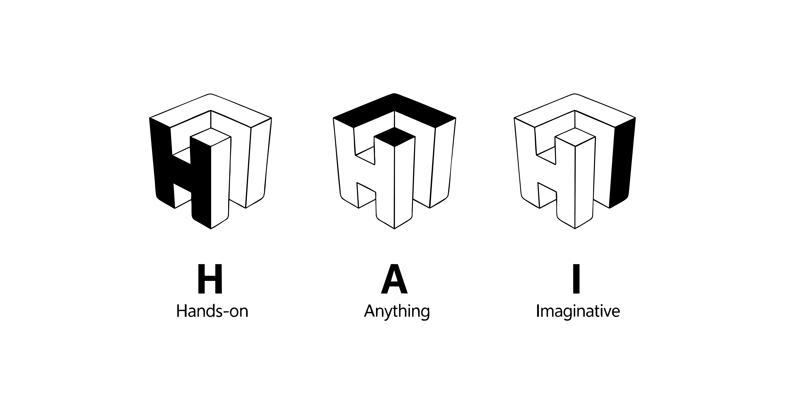
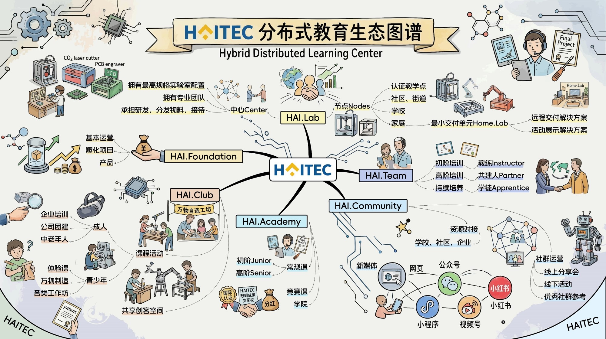

# Home

## Hello, I'm Cheng Pan
## Welcome to HAITEC
   

## What is HAITEC?  
  

HAITEC — Innovation Ecosystem

HAITEC is more than a makerspace—it's a platform for innovation. We bring together education, technology, design, and community to empower creators of all ages. Through hands-on learning, digital fabrication, AI, and collaborative innovation, we help transform ideas into real-world solutions.

Our ecosystem is built around six interconnected initiatives:

**HAI.Lab**  
A space for research, prototyping, digital fabrication, and creative engineering.

**HAI.Academy**  
Project-based education in AI, robotics, digital making, design thinking, and future-ready skills.

**HAI.Club**  
A membership network connecting makers, innovators, entrepreneurs, and lifelong learners.

**HAI.Community**  
An open platform that partners with schools, libraries, governments, and organizations to make innovation accessible to everyone.

**HAI.OPC**  
 Empowers individuals to build and operate a One Person Company. By combining AI, digital tools, automation, creative technology, and entrepreneurship, we help creators, educators, makers, and innovators turn their ideas into sustainable businesses.

**HAI.Foundation**  
Our social impact initiative dedicated to expanding access to maker education, supporting young innovators, and promoting sustainable technological development.

*Whether you're a student, educator, entrepreneur, or creator, [HAITEC](http://haitec.top/) is where ideas become reality.*